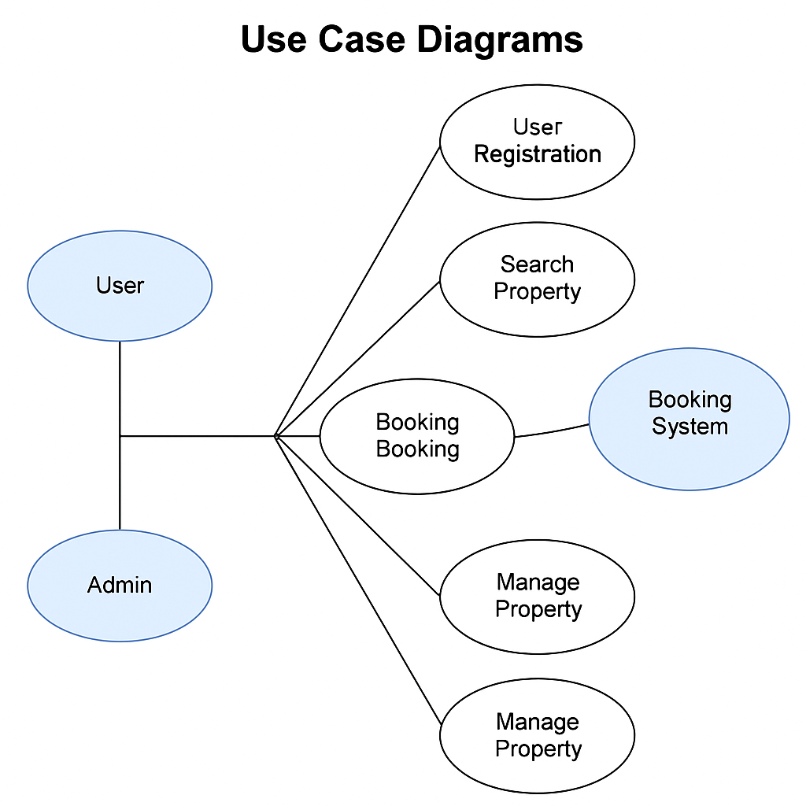

# requirement-analysis

## Requirement Analysis in Software Development

This repository explores the process of **Requirement Analysis** in the software development life cycle (SDLC). The goal is to define and gather functional and non-functional requirements to ensure the successful planning and execution of a project. Here, we document key activities, techniques, and best practices to ensure that stakeholders' needs are met and that the project scope is well-defined.

## What is Requirement Analysis?
Requirement Analysis is a critical phase in the software development lifecycle (SDLC) where the project team gathers, analyzes, and defines the requirements of the software product to be developed. This process ensures that all stakeholders have a clear and mutual understanding of what the system should do and how it should perform.

## Why is Requirement Analysis Important?

Clarity and Understanding: It helps in understanding what the stakeholders expect from the software, reducing ambiguity.
Scope Definition: Clearly defines the scope of the project, which helps in preventing scope creep.
Basis for Design and Development: Provides a solid foundation for designing and developing the system.
Cost and Time Estimation: Facilitates accurate estimation of project cost, resources, and time.
Quality Assurance: Ensures that the final product meets the specified requirements, leading to higher customer satisfaction.

## Key Activities in Requirement Analysis

There are five key activities in Requirement Analysis:

- **Requirement Gathering:** Collecting all relevant information and input from stakeholders through interviews, surveys, and workshops.
  
- **Requirement Elicitation:** Extracting detailed requirements using techniques such as brainstorming, use cases, and prototyping.
  
- **Requirement Documentation:** Creating detailed documents such as requirement specifications and use cases to formally record the gathered and elicited requirements.
  
- **Requirement Analysis and Modeling:** Analyzing the documented requirements and modeling them to understand dependencies and interactions. This often includes creating flow diagrams, use case diagrams, and other representations.
  
- **Requirement Validation:** Ensuring that the requirements are accurate, feasible, and align with the project goals by reviewing them with stakeholders and verifying that they can be realistically implemented.

## Types of Requirements

### Functional Requirements
Functional requirements define what the system should do. They focus on specific behaviors, functionalities, and features the system must have. Example for the booking management system:
- **User Registration:** The system should allow users to register by providing personal details such as name, email, and phone number.
- **Property Search:** Users should be able to search for available properties based on location, price, and type.

### Non-functional Requirements
Non-functional requirements specify how the system should perform. They address aspects such as performance, security, and usability. Example for the booking management system:
- **Performance:** The system should respond within 2 seconds for each search query.
- **Security:** The system should securely store user data and comply with privacy regulations.

## Use Case Diagrams

Use Case Diagrams are used to visualize the interactions between users (actors) and the system. They help define the system's functionality from the user's perspective. Benefits include:
- Simplifying complex systems by focusing on what the system should do.
- Helping stakeholders understand and validate system requirements.

Here is a use case diagram for the booking system, showing actors such as **User**, **Admin**, and **Booking System**, and use cases like **Register User**, **Search Property**, and **Book Property**.

## Acceptance Criteria

Acceptance Criteria are conditions that a feature must meet to be accepted by stakeholders. They ensure that the system meets the expected quality and functionality. For the Checkout feature in the booking management system, an example of acceptance criteria could be:

- **Must allow users to enter payment details securely.**
- **Should display the total amount to be paid, including taxes and discounts, before confirmation.**
- **After successful payment, the system should confirm the booking and send an email receipt.**

These criteria help validate that the system works as expected before moving to the next phase.
